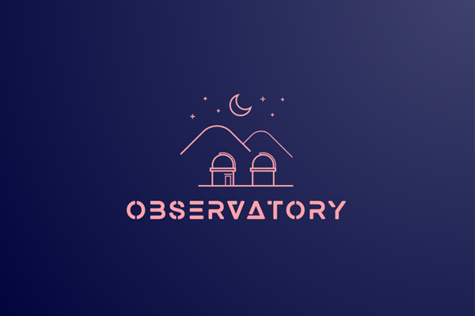

  

  
  
  
  
  
   

:artificial_satellite: Front-end interface for interacting with the Celestial Bodies package.

## Introduction
Observatory is the front-end interface for the Celestial Bodies package. Full documentation coming soon.

